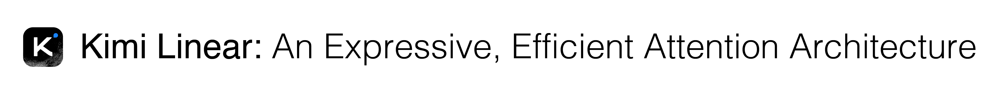
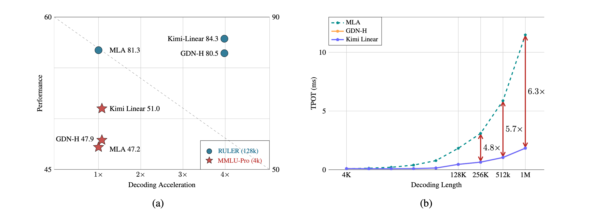
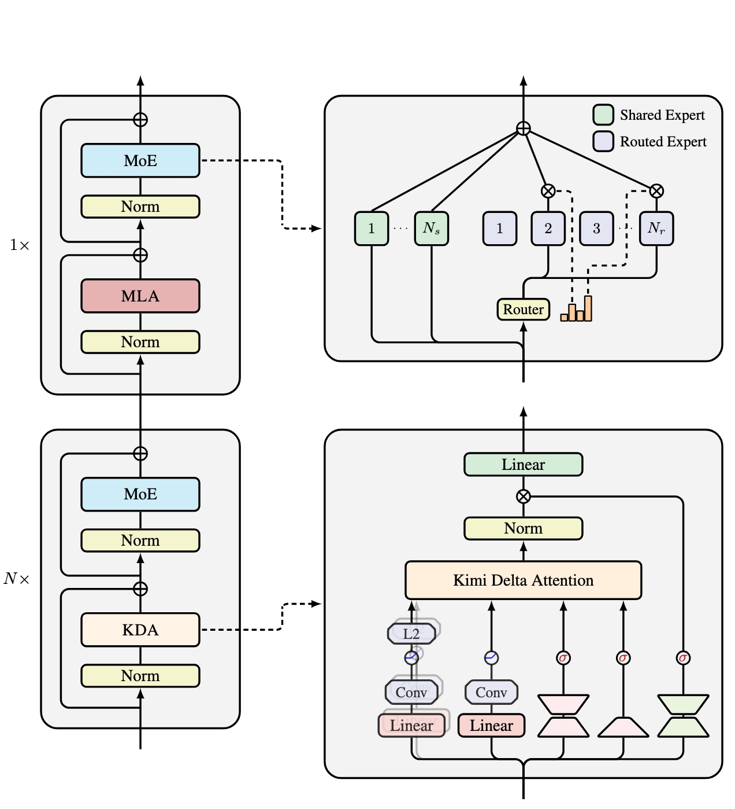

<div align="center">
  <a href="tech_report.pdf"></a>
</div>

<div align="center">
  <a href="tech_report.pdf"><b> Tech Report</b></a>  |  
  <a href="https://huggingface.co/moonshotai/Kimi-Linear-48B-A3B-Instruct"><b> HuggingFace</b></a>
</div>


<div align="center">
  
  <p><em><b>(a)</b> On MMLU-Pro (4k context length), Kimi Linear achieves 51.0 performance with similar speed as full attention. On RULER (128k context length), it shows Pareto-optimal performance (84.3) and a 3.98x speedup. <b>(b)</b> Kimi Linear achieves 6.3x faster TPOT compared to MLA, offering significant speedups at long sequence lengths (1M tokens).</em></p>
</div>

## Overview

Kimi Linear is a hybrid linear attention architecture that outperforms traditional full attention methods across various contexts, including short, long, and reinforcement learning (RL) scaling regimes. 
At it's core is Kimi Delta Attention (KDA)—a refined version of [Gated DeltaNet](https://arxiv.org/abs/2412.06464) that introduces a more efficient gating mechanism to optimize the use of finite-state RNN memory.

Kimi Linear achieves superior performance and hardware efficiency, especially for long-context tasks. It reduces the need for large KV caches by up to 75% and boosts decoding throughput by up to $6\times$ for context as long as 1M tokens.

We open-sourced the KDA kernel in [FLA](https://github.com/fla-org/flash-linear-attention/tree/main/fla/ops/kda), and released two versions model checkpoints trained with 5.7T tokens.


|      **Model**       | **#Total Params** | **#Activated Params** | **Context Length** |                                **Download Link**                                 |
| :------------------: | :---------------: | :-------------------: | :----------------: | :------------------------------------------------------------------------------: |
|   Kimi-Linear-Base   |        48B        |          3B           |         1M         |   [🤗 Hugging Face](https://huggingface.co/moonshotai/Kimi-Linear-48B-A3B-Base)   |
| Kimi-Linear-Instruct |        48B        |          3B           |         1M         | [🤗 Hugging Face](https://huggingface.co/moonshotai/Kimi-Linear-48B-A3B-Instruct) |

## Key Features

- **Kimi Delta Attention (KDA):** A linear attention mechanism that refines the gated delta rule with finegrained gating.
- **Hybrid Architecture:** A 3:1 KDA-to-global MLA ratio reduces memory usage while maintaining or surpassing the quality of full attention.
- **Superior Performance:** Outperforms full attention in a variety of tasks, including long-context and RL-style benchmarks on 1.4T token training runs with fair comparisons.
- **High Throughput:** Achieves up to $6\times$ faster decoding and significantly reduces time per output token (TPOT).

<div align="center">
  
</div>

## Usage

### Inference with Hugging Face Transformers 

To use the Kimi Linear model, we recommend the following:

* Language: `python` >= 3.10
* Package: `torch` >= 2.6
* Package: `fla-core` >= 0.4.0

```shell
pip install -U fla-core
```

Example Code:
```py
from transformers import AutoModelForCausalLM, AutoTokenizer

model_name = "moonshotai/Kimi-Linear-48B-A3B-Instruct"
model = AutoModelForCausalLM.from_pretrained(
    model_name,
    torch_dtype="auto",
    device_map="auto",
    trust_remote_code=True
)
tokenizer = AutoTokenizer.from_pretrained(model_name, trust_remote_code=True)

messages = [
    {"role": "system", "content": "You are a helpful assistant provided by Moonshot-AI."},
    {"role": "user", "content": "Is 123 a prime?"}
]
input_ids = tokenizer.apply_chat_template(
    messages, 
    add_generation_prompt=True, 
    return_tensors="pt"
).to(model.device)
generated_ids = model.generate(inputs=input_ids, max_new_tokens=500)
response = tokenizer.batch_decode(generated_ids)[0]
print(response)
```

### Deployment

For deployment, you can use the latest vllm to create an OpenAI-compatible API endpoint.

```sh
vllm serve moonshotai/Kimi-Linear-48B-A3B-Instruct \
  --port 8000 \
  --tensor-parallel-size 4 \
  --max-model-len 1048576 \
  --trust-remote-code
```

## Citation

If you found our work useful, please cite
```bibtex
@article{kimi2025kda,
  title  = {Kimi Linear: An Expressive, Efficient Attention Architecture},
  author = {kimi Team},
  year   = {2025},
  url    = {https://github.com/MoonshotAI/Kimi-Linear/blob/master/tech_report.pdf}
}
```
